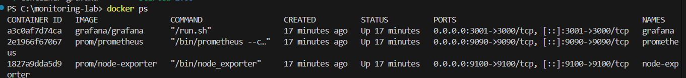
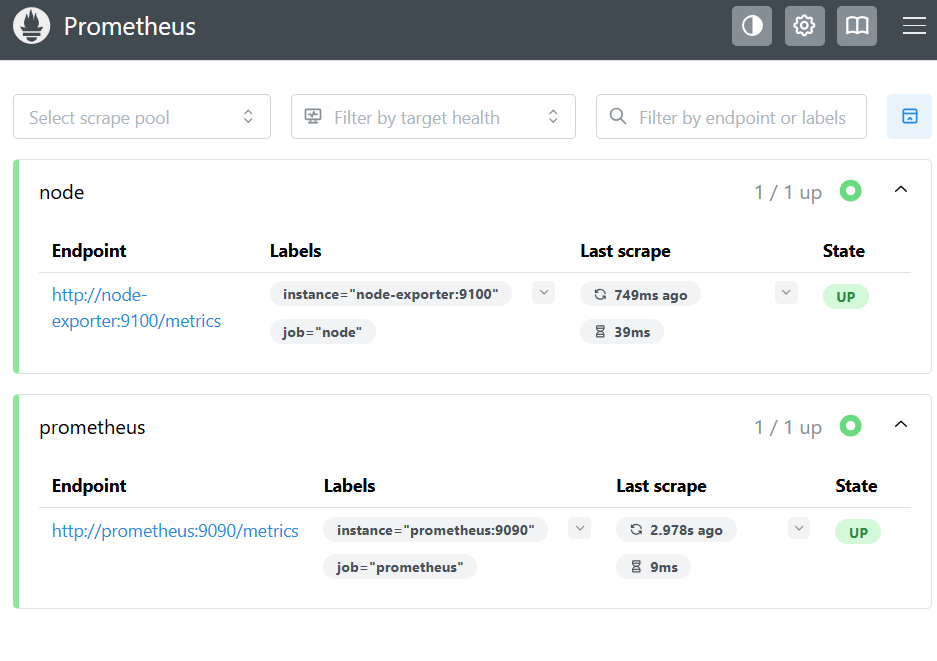
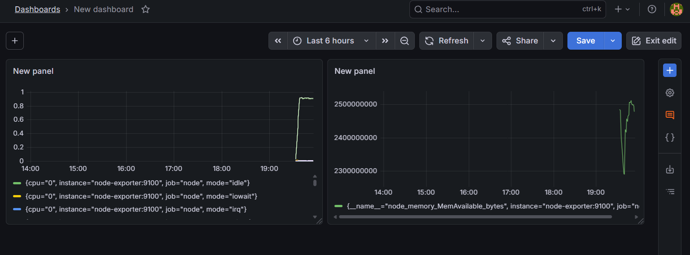

# Monitoring Lab - Prometheus + Grafana (Docker)

## Descripción
Este proyecto consiste en la implementación de un sistema básico de monitoreo utilizando contenedores Docker. Se integran herramientas como Prometheus y Grafana para recolectar, procesar y visualizar métricas del sistema en tiempo real.

El objetivo principal es comprender el flujo de monitoreo moderno: desde la recolección de datos hasta su visualización.

## Tecnologías utilizadas

- Docker
- Docker Compose
- Prometheus
- Grafana
- Node Exporter

## Ejecución del proyecto

### 1. Clonar el repositorio

git clone <URL_DEL_REPOSITORIO>
cd <NOMBRE_DEL_PROYECTO>

### 2. Levantar los servicios
docker-compose up -d

### 3. Verificar contenedores
docker ps

## Accesos

Servicio	URL
Prometheus	http://localhost:9090

Grafana	    http://localhost:3001

## Arquitectura del sistema

El flujo de monitoreo funciona de la siguiente manera:

- Node Exporter expone las métricas del sistema operativo.
- Prometheus recolecta y almacena estas métricas.
- Grafana se conecta a Prometheus como fuente de datos (Data Source) para visualizar la información.

## Métricas utilizadas

### CPU
node_cpu_seconds_total
### Memoria
node_memory_Active_bytes

## Evidencias del proyecto

Docker en ejecución

Targets en Prometheus

Dashboard en Grafana

## Aprendizajes

Durante esta práctica se adquirieron conocimientos sobre:

Monitoreo de sistemas con Prometheus
Visualización de métricas con Grafana
Uso y gestión de contenedores con Docker
Configuración de exportadores de métricas

## Autor

Keren Almonte Guilamo